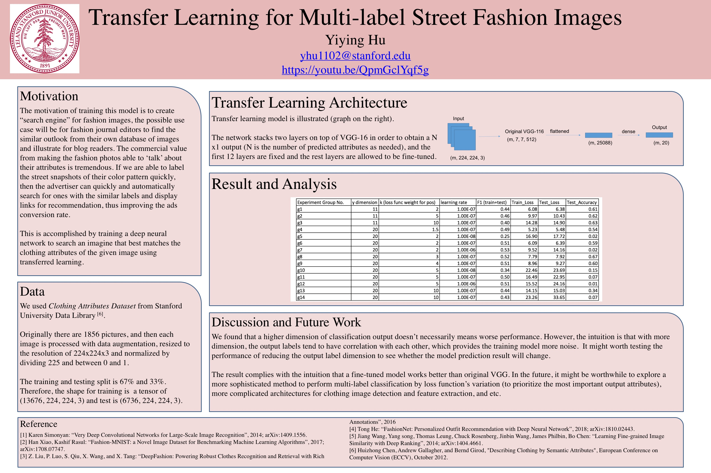

Intro: this project is for CS230 Deep Learning at Stanford Univerity (course info: https://cs230.stanford.edu/)

1. Goal

The motivation of training this model is to create “search engine” for fashion images, the possible use case will be for fashion journal editors to find the similar outlook from their own database of images and illustrate for blog readers. The commercial value from making the fashion photos able to ‘talk’ about their attributes is tremendous. If we are able to label the street snapshots of their color pattern quickly, then the advertiser can quickly and automatically search for ones with the similar labels and display links for recommendation, thus improving the ads conversion rate. We trained a deep neural network to predict the clothing attributes of fashion images using transferred learning on top of pre-trained VGG-16. 

2. Data

We used clothing attributes dataset of Research from Stanford University Data and More from Stanford's Cutting Edge Researchers

Originally there are 1856 pictures [6], and each image is processed with data augmentation, resized to the resolution of 224x224x3 and normalized by dividing 225 and between 0 and 1

The training and testing split is 67% and 33%. Therefore, the shape for training is  a tensor of (13676, 224, 224, 3) and test is (6736, 224, 224, 3). 

3. Final Project Poster

